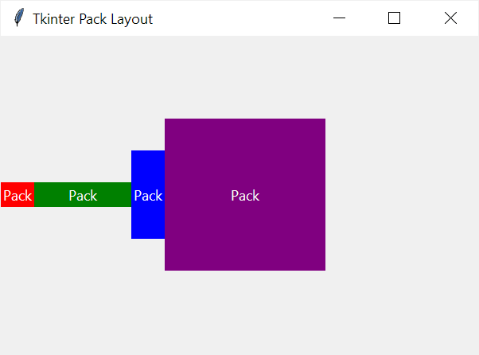
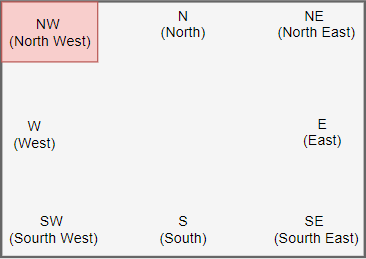

# Ejemplo Práctico: Organización de Elementos (Grid y Pack)

En este ejemplo vamos a abordar uno de los conceptos más confusos para quienes inician en Tkinter: **cómo organizar y posicionar los elementos en la ventana** utilizando Gestores de Geometría (Layout Managers).

A continuación, destacaremos los hitos más importantes de esta implementación.

---

## 1. El Sistema `pack()` (Apilamiento)

El método `pack()` es el más sencillo de utilizar. Funciona "apilando" los elementos uno detrás del otro, como si fueran bloques en una caja.
* Por defecto, `pack()` apila los elementos de arriba hacia abajo (verticalmente).
* Puedes usar los parámetros `side="left"` o `side="right"` para apilarlos horizontalmente, como lo hicimos con los botones de "Aceptar" y "Cancelar".

### ¿Cuándo usar `pack()`?
Es ideal para interfaces muy simples, barras de herramientas, títulos, o cuando solo quieres que los elementos queden uno debajo del otro sin complicaciones.

### Ejemplo

```python
import tkinter as tk

root = tk.Tk()
root.title('Tkinter Pack Layout')
root.geometry('600x400')

label1 = tk.Label(root, text='Pack',bg='red',fg='white')
label2 = tk.Label(root,text='Pack',bg='green', fg='white')
label3 = tk.Label(root, text='Pack',bg='blue', fg='white')
label4 = tk.Label(root, text='Pack',bg='purple', fg='white')

label1.pack(side=tk.LEFT)
label2.pack(side=tk.LEFT, ipadx=40)
label3.pack(side=tk.LEFT, ipady=40)
label4.pack(side=tk.LEFT, ipadx=80, ipady=80)

root.mainloop()
```



---

## 2. El Sistema `grid()` (Cuadrícula o Tabla)

El método `grid()` organiza los elementos simulando una tabla de Excel, mediante `row` (fila) y `column` (columna).
* **`row=0, column=0`:** Es la celda superior izquierda.
* **`sticky`:** Le indica al elemento hacia dónde debe alinearse dentro de su celda (`"w"` es izquierda/oeste, `"e"` es derecha/este, `"n"` es arriba/norte, `"s"` es abajo/sur).

### ¿Cuándo usar `grid()`?
Es la mejor opción (y la más recomendada) para hacer **formularios** u organizar datos tabulares. Te permite alinear perfectamente las etiquetas (como "Nombre:") con las entradas de texto.



---

## 3. Combinando Sistemas mediante `Frames`

**¡Regla de Oro en Tkinter!** Nunca debes mezclar `pack()` y `grid()` dentro del mismo contenedor padre, o el programa se quedará congelado tratando de calcular los tamaños.

Sin embargo, en este ejemplo sí usamos ambos. ¿Cómo?
* Dividimos la ventana principal en **Frames** (contenedores invisibles).
* Los Frames en sí mismos se organizaron usando `pack()`.
* **Pero por dentro**, el Frame central usa `grid()` para el formulario, mientras que los Frames superior e inferior usan `pack()` para sus propios elementos. Esta es la técnica correcta para crear interfaces avanzadas.

### 🔧 ¡Pruébalo tú mismo!
Intenta interactuar con el código y modificar la interfaz:
1. Añade un nuevo campo al formulario llamado "Edad" en la `row=2` del grid.
2. Modifica los botones de la parte inferior para que estén apilados en el centro en lugar de a la izquierda (`side="top"` en lugar de `"left"` o usando un Frame intermedio).

